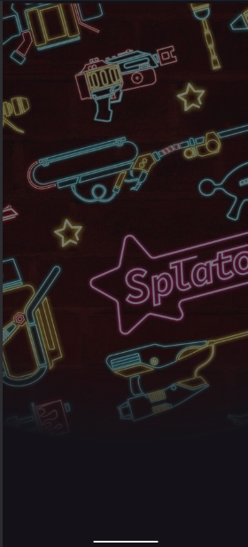
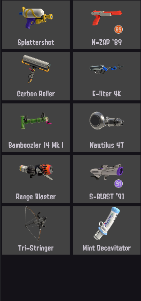
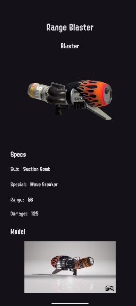

<p align="center"> &nbsp; &nbsp; &nbsp; &nbsp; &nbsp;  </p>
<h1 align= "center"> SplatoonWeaponsApp </h1>

SplatoonWeaponsApp is a polished Android application that consumes a RESTful API (hosted on Apiary) to display weapon data in a responsive, user-friendly interface. Integrated with Firebase Authentication, this project demonstrates your skills in building a modern mobile app: from networking and dependency management to UI/UX best practices. While Room isn’t part of the core functionality yet, there is a clear path laid out for adding local data persistence in the near future.

Showcases: API integration, clean modular structure, custom fonts, Firebase Auth, and best practices—perfect for a mobile-dev portfolio.

### 🚀 App Showcase
<div align="center">
  
  
   </div>

### 🎯 Features
- **REST API Consumer**: Fetches and displays a list of weapons from a hosted Apiary endpoint using Retrofit.
- **Firebase Authentication:** Secure login flow with email/password; users can access protected content once authenticated.
- **Modular UI**: Employs Fragment-based navigation (Splash, Login, List, Detail) with custom animations and splash screen.
- **RecyclerView + Adapter:** Optimized list of weapons displaying images, names, and brief stats. Taps on an item launch a detail view.
- **Image Loading:** Integrated Picasso for efficient image fetching, caching, and placeholder/error handling.
- **Custom Fonts & Themes**: Utilizes blitz_bold.otf, blitz_main.otf, and sp_alterna_regular.otf in res/font/ as Splatoon official fonts.
- **Sealed UI States:** Gracefully handles loading, success, and error states in both list and detail screens. If API data is missing, UI adapts (e.g., hides unavailable views).
- **Clean Project Structure:** Clear separation between data/, ui/, auth/, constants/, and utils/ packages—making it easy to onboard new devs or extend functionality.
- **Future-proof**: Room implementation is planned to enable offline caching and local persistence in a later iteration.

### 🛠️ Technology Stack
- Programming Language: Kotlin
- Android SDK: API Level 24+ (minSdk 24)
- Retrofit for REST calls
- OkHttp (via Retrofit) for HTTP client
- Dependency Injection / Configuration: Simple manual DI via singletons in RetrofitHelper.kt
- Authentication: Firebase Auth (Email/Password)
- Image Loading: Picasso

##### UI Components:

- AndroidX Fragments & RecyclerView
- ConstraintLayout for responsive layouts
- Material Design components (Buttons, TextInputLayouts, etc.)
- Persistence (Future): Room (planned)
- Project Build: Gradle Kotlin DSL (build.gradle.kts)

📂 Project Structure
```bash
SplatoonWeaponsApp/
├── app/
│   ├── src/
│   │   ├── main/
│   │   │   ├── java/com/tanucode/practica2/
│   │   │   │   ├── application/
│   │   │   │   │   └── WeaponsRFAPP.kt        # Custom Application class (initializes singletons, fonts)
│   │   │   │   ├── auth/
│   │   │   │   │   └── LoginActivity.kt       # Firebase Auth flow
│   │   │   │   ├── constants/
│   │   │   │   │   └── Constants.kt           # API base URL, Firebase constants, etc.
│   │   │   │   ├── data/
│   │   │   │   │   ├── WeaponsRepository.kt   # Repository pattern (fetches from API/Room in future)
│   │   │   │   │   └── remote/
│   │   │   │   │       ├── RetrofitHelper.kt  # Retrofit instance provider
│   │   │   │   │       ├── WeaponApi.kt        # Retrofit service interface
│   │   │   │   │       └── model/              # DTOs: WeaponDto, WeaponDetailDto, WeaponsList
│   │   │   │   ├── ui/
│   │   │   │   │   ├── SplashActivity.kt      # Launch screen with custom animations
│   │   │   │   │   ├── adapters/
│   │   │   │   │   │   ├── WeaponViewHolder.kt # Binds weapon data to item views
│   │   │   │   │   │   └── WeaponsAdapter.kt    # RecyclerView Adapter
│   │   │   │   │   └── fragments/
│   │   │   │   │       ├── WeaponListFragment.kt   # Shows list of weapons
│   │   │   │   │       └── WeaponDetailFragment.kt # Shows detailed info on selected weapon
│   │   │   │   └── utils/
│   │   │   │       └── Extensions.kt          # Extension functions (e.g., View visibility helpers)
│   │   │   └── res/
│   │   │       ├── layout/                    # XML layouts (activity_login.xml, fragment_* etc.)
│   │   │       ├── drawable/                   # Icons, splash screen, placeholder images
│   │   │       ├── font/                       # Custom font files
│   │   │       ├── values/                     # colors.xml, strings.xml, dimensions, styles, themes
│   │   │       └── xml/                        # backup_rules.xml, data_extraction_rules.xml
│   └── build.gradle.kts                        # Module-level Gradle config
├── build.gradle.kts                            # Root Gradle config
├── settings.gradle.kts                         # Includes modules
└── README.md                                   # ← You are here
```

### 🌱 Future Improvements
##### Room Persistence
Why: Enable offline-first behavior, faster load times, and local caching of API responses.
Benefit: Demonstrates knowledge of Jetpack components, database design (entities, DAOs), and repository pattern.

##### Dependency Injection (Hilt/Dagger)
Swap manual singletons for Hilt to inject Retrofit, Repository, and ViewModel dependencies automatically.

##### MVVM Architecture
Extract business logic into ViewModel classes under ui/viewmodel/, observing LiveData/StateFlow to handle UI states more cleanly.

##### UI/UX Enhancements
- Add pull-to-refresh on the list.
- Implement shimmer-style loading placeholders.
- Animate transitions between list/detail screens.

##### Unit & Instrumentation Tests

- Write tests for the repository (mocking Retrofit).
- Use Espresso for navigation and UI assertions (e.g., list renders correctly).

### 💼 Contact
- [GitHub Profile](https://github.com/gsalvador209)
- [LinkedIn](https://www.linkedin.com/in/gsalvador209/) 

Made with ❤️ by Chava for [App Development for Mobile Devices Course](https://infierno2.tic.unam.mx/diplomado-en-dispositivos-moviles)  
 
